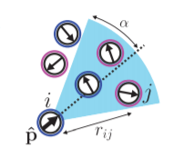

# janus-particles
The emergent behavior of agents acting on local rules in *[0,1]2.*

This repository contains code and related work for an undergraduate research project at Montana State University.
The project was done in collaboration with Griffin Smith, Dr. Dominique Zosso, and Dr. Scott McCalla (all of MSU).

The code in this repository runs a simulation involving *n* agents in the plane.
Each agent has a
 * position *(x,y) \in [0,1]2*
 * orientation *\theta \in [0,2pi)*
 * half-angle *\alpha \in [0,pi]* that creates a field of view (picture shown for clarification)

In addition, the system keeps track of a velocity *v* and a perception threshold *p*.
For agent *a* to percieve agent *b*, *b* must be in *a's* field of view, then the strength of the perception is inversely proportional to the distance between the agents.
The system begins at a state and iterates the positions of each agent according to the following rules:
 1. Randomly perturb the position and orientation of each agent
 1. If total perception (summed perception with all other agents) is greater than *p*, move forward with velocity *v*

The system then iterates until a cap.
The goal of this research is to discover the emergent behavior of the agents based on the initial conditions.

This repository contains the following directories.
 * **AgentSimulator/** - Java implementation of the simulation (no graphics can be displayed)
 * **AgentSimulatorG/** - Java implementation of the simulation (there is an option to display graphics)
 * **code-drafts/** - contains the beginnings of both a Java and MATLAB implementation of the simulation (to get a feel for which language would be most appropriate)
 * **data/** - contains the output for the simulation runs
 * **img/** - contains images for the repository and papers
 * **knowledge/** - contains reference papers
 * **sim-scripts/** - contains scripts to run the simulation

To run the simulation, use scripts in **sim-scripts** or *java -jar AgentSimulator.jar \<DIRECTORY\>* on the command line where \<DIRECTORY\> is the output directory.
\<DIRECTORY\> should already exist and contain a file called *.config* that has the information shown in the following table.
There should be no blank lines in *.config* and no spaces between a property and its value (correct format: MAX_ITER=10000).

| Property             | Info                                                                           |
|----------------------|--------------------------------------------------------------------------------|
|MAX_ITER=X            |integer (maximum number of iterations for simulation)                           |
|STATE=X               |integer (interval for writing state to file; 0 => only initial and final)       |
|LOG=X                 |integer (interval for writing to console/log; 0 => minimal logging)             |
|GRAPHICS=X            |integer (interval for updating graphics window; 0 => no graphics)               |
|INITIAL_STATE=X       |string  (r => random distribution; anything else is interpreted as a file name) |
|POS_STDV=X            |float   (standard deviation for generating position deltas from a Gaussian)     |
|ANG_STDV=X            |float   (standard deviation for generating angle deltas from a Gaussian)        |
|NUM_AGENTS=X          |integer (number of agents in the system)                                        |
|ALPHA=X               |float   (half-angle alpha for the field-of-view)                                |
|PERCEIVED_WEIGHT=X    |float   (w in 1/(w\*d) where d is distance between agents)                      |
|THRESHOLD=X           |float   (perception threshold to move forward)                                  |
|VELOCITY=X            |float   (forward velocity of activated agents)                                  |
