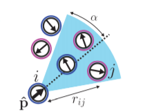

# janus-particles
A simulation of agents acting on local rules in the plane and their emergent behavior

This repository contains code and related work for an undergraduate research project and Montana State University.
The project was done in collaboration with Griffin Smith and Dr. Dominique Zosso (both of MSU).

The code in this repository runs a simulation involving *n* agents in the plane.
Each agent has a
 * position *(x,y) \in [0,1]2* 
 * orientation *\theta \in [0,2pi)*
 * half-angle *\alpha \in [0,pi]* that creates a field of view (picture shown for clarification)

In addition, the system keeps track of a velocity *v* and a perception threshold *p*.
For agent *a* to percieve agent *b*, *b* must be in *a's* field of view, then the strength of the perception is inversely proportional to the distance between the agents.
The system begins at a state and iterates the positions of each agent according to the following rules:
 1. Randomly perturb the position and orientation of each agent
 1. If total perception (summed perception with all other agents) is greater than *p*, move forward with velocity *v*
 
The system then iterates until a cap or convergence.
The goal of this research is to discover the emergent behavior of the agents based on the initial conditions.

This repository contains the following directories.
 * img/ - contains images for the repository and papers
 * knowledge/ - contains reference papers
 * exploring-options/ - contains the beginnings of both a Java and MATLAB implementation of the simulation (to get a feel for which language would be most appropriate)
